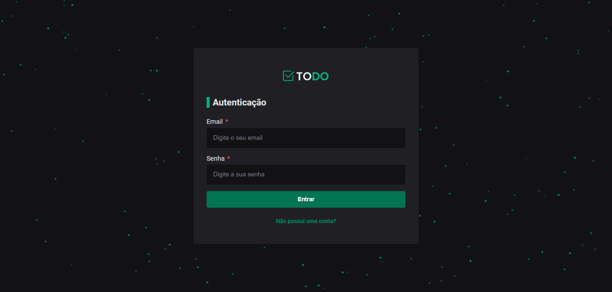
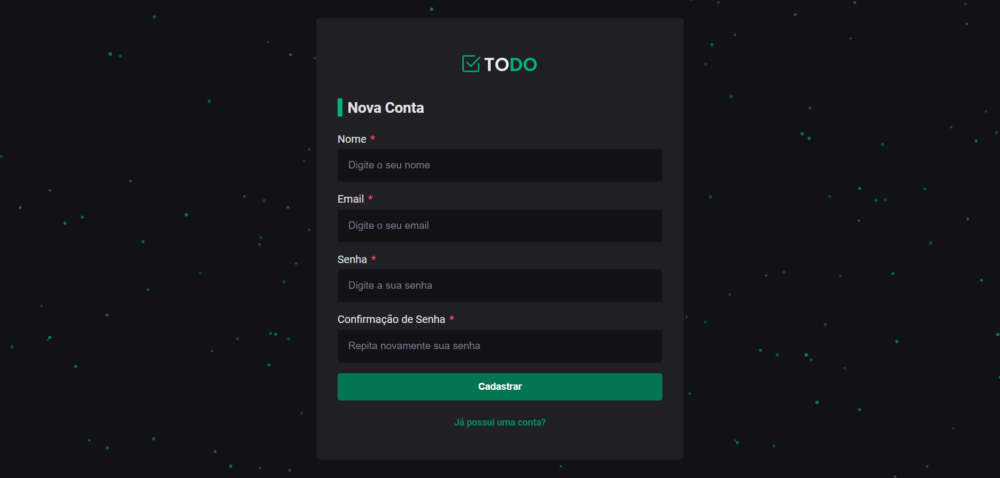
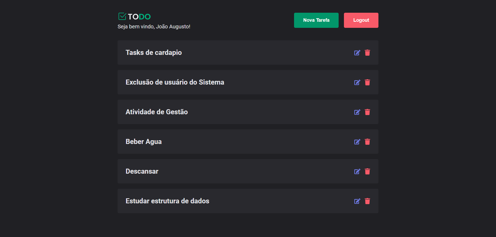
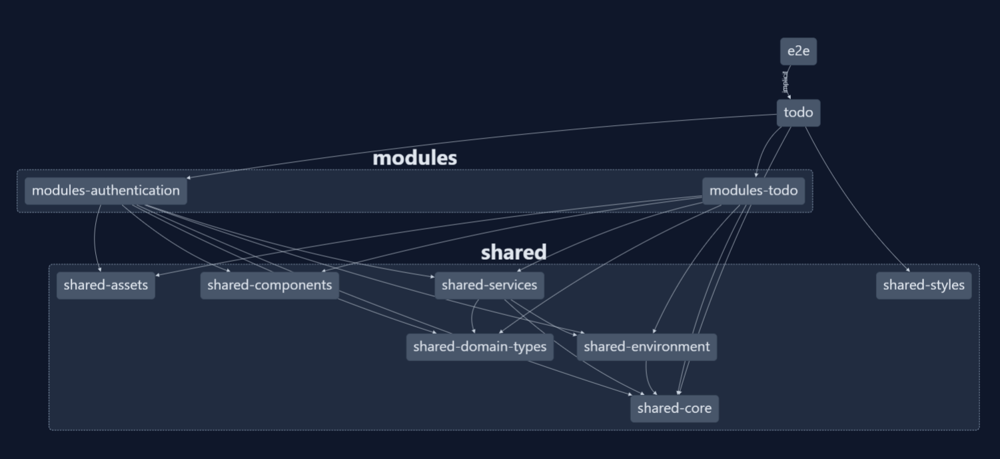

## :rocket: Projeto Todo

<h1  align="center"></h1>
<h1 align="center"></h1>
<h1 align="center"></h1>
<h1 align="center"></h1>

Nesse projeto TODO que eu criei, o objetivo principal foi colocar em prática os conhecimentos adquiridos sobre arquitetura limpa, clean code, CI e CD.

### Tecnologias utilizadas:

- React
- TypeScript
- Custom Hooks
- Context API
- LocalStorage
- Private Route
- React Hook Form

No projeto, desenvolvi um sistema que permite a criação e autenticação de usuários, bem como a criação, leitura, atualização e deleção de tarefas (conhecido como CRUD). Com o objetivo de seguir os princípios de clean code, criei uma abstração chamada httpClient que permite realizar as requisições HTTP de forma independente do axios.

A implementação do axios foi feita por meio da classe AxiosHttpClient, que implementa a interface httpClient. O sistema foi desenvolvido seguindo diversas práticas de arquitetura limpa e clean code, resultando em uma solução simples e bem organizada.

Além disso, no projeto foi utilizado o Nx workspace para permitir a visualização gráfica das bibliotecas, facilitando a compreensão das relações entre elas. A configuração do CI foi realizada para garantir a qualidade do código, executando testes, lint e build a cada push no repositório do GitHub, através do GitHub Actions. Também foi implementado o Continuous Deployment com a Vercel, possibilitando que o deploy seja realizado automaticamente com cada pull request na main. Tudo isso demonstra um cuidado com a qualidade do código e uma preocupação constante em entregar valor ao usuário final.

### Como rodar o projeto

```bash
# Clone o projeto
$ git clone https://github.com/augustodevjs/clean-architecture-todo

# Instale todas as depedências
$ yarn

# Rode o projeto
$ yarn start

```
